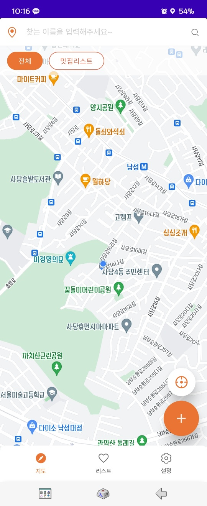
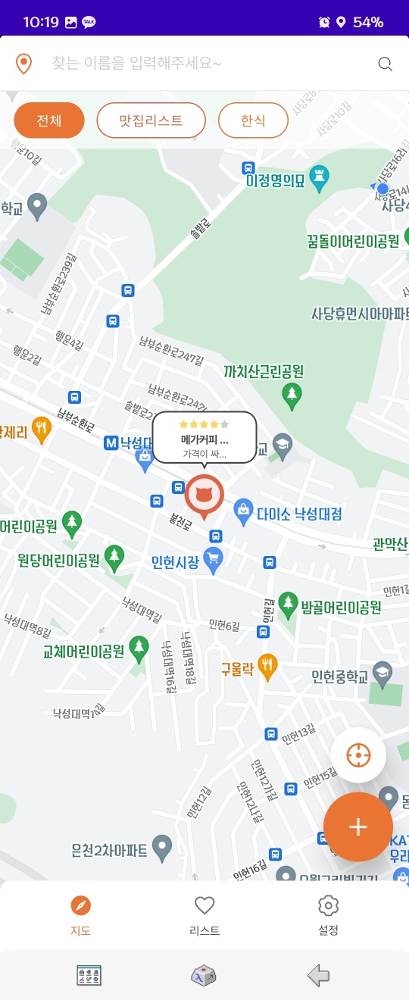
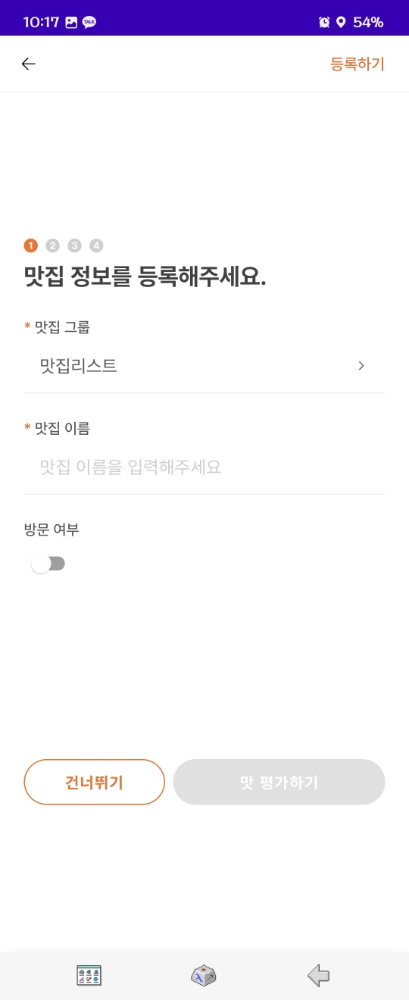
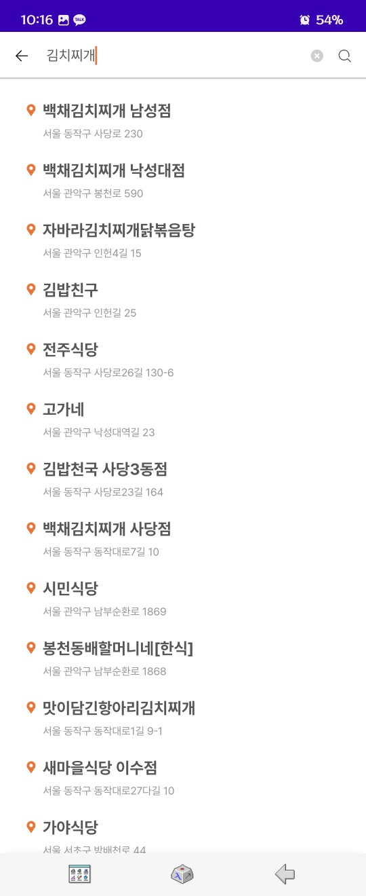
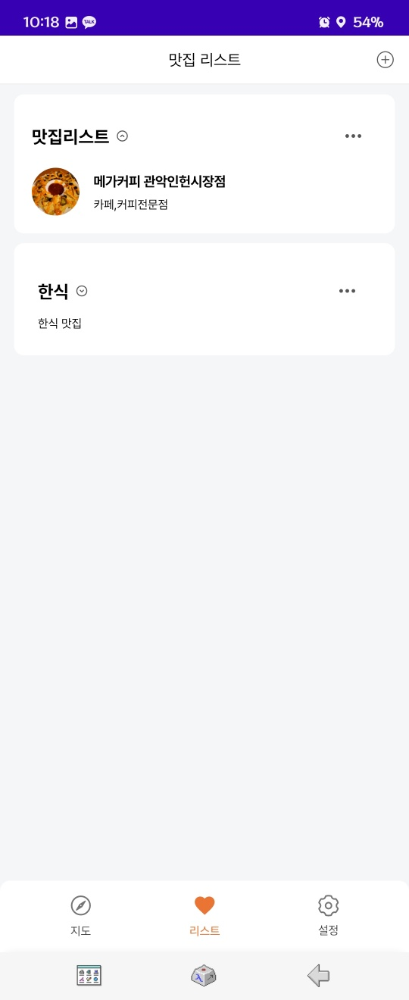
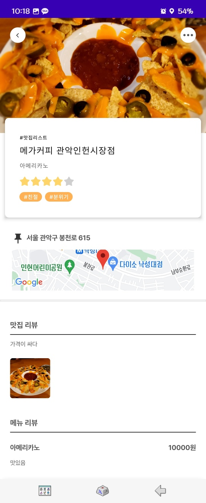
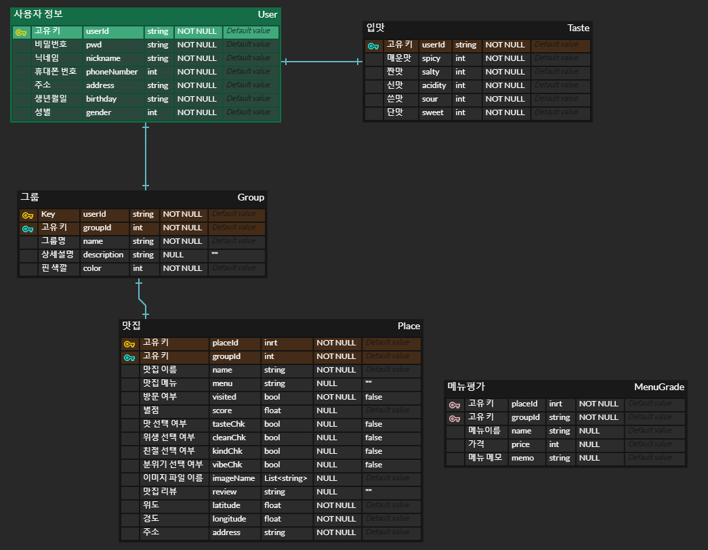

# yogo

**자신만의 맛집 리스트와 위시리스트 관리를 위한 어플리케이션**

회고 링크 - https://potato-dev.tistory.com/108

어플 링크 - https://play.google.com/store/apps/details?id=com.yogo.wifood(실행은 안됩니다...)

## 멤버

- 장예훈 - Android Backend
- 김강직 - Android Frontend
- 김민형 - Android Backend
- 정혜연 - Designer

## 주요 기능

- 메인화면은 현재 그룹 별 맛집 위치와 내 현재 위치를 지도에서 확인할 수 있고 맛집 검색이 가능합니다.

- 맛집 등록 화면은 그룹, 맛집, 방문여부, 별점, 메뉴 가격 등의 정보들을 입력하여 맛집을 등록해 나만의 맛집 리스트를 추가할 수 있습니다.

- 검색 화면은 메인화면과 맛집 등록 화면에서 추가하고 싶은 맛집을 검색할 수 있습니다.

- 맛집 리스트 화면은 추가한 맛집들을 그룹 별로 나누어 보여주며 맛집 이름과 해당 맛집의 분류명, 사진을 확인할 수 있습니다.

- 맛집 정보 화면은 자신이 추가한 맛집에 대한 정보들을 보여줍니다. 추가한 맛집에 대한 자세한 정보들을 확인할 수 있습니다.

## 디비 구조

